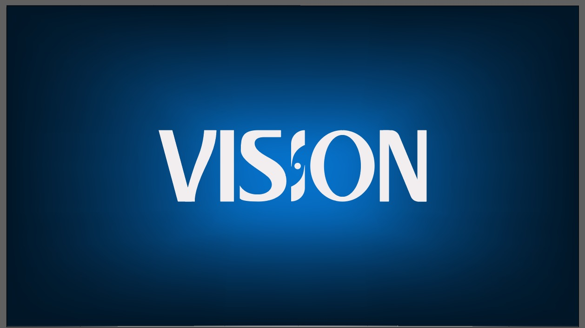

# Vision - Best Practices

<!---Esses são exemplos. Veja https://shields.io para outras pessoas ou para personalizar este conjunto de escudos. Você pode querer incluir dependências, status do projeto e informações de licença aqui--->

<!---

--->

> Linha adicional de texto informativo sobre o que o projeto faz. Sua introdução deve ter cerca de 2 ou 3 linhas. Não exagere, as pessoas não vão ler.

### Ajustes e melhorias

O projeto ainda está em desenvolvimento e as próximas atualizações serão voltadas nas seguintes tarefas:

- [x] Tarefa 1
- [x] Tarefa 2
- [x] Tarefa 3
- [ ] Tarefa 4
- [ ] Tarefa 5

Adicione comandos de execução e exemplos que você acha que os usuários acharão úteis. Fornece uma referência de opções para pontos de bônus!

## 📫 Contributing to the Vision
<!---Se o seu README for longo ou se você tiver algum processo ou etapas específicas que deseja que os contribuidores sigam, considere a criação de um arquivo CONTRIBUTING.md separado--->
Para contribuir com <nome_do_projeto>, siga estas etapas:

1. Bifurque este repositório.
2. Crie um branch: `git checkout -b <nome_branch>`.
3. Faça suas alterações e confirme-as: `git commit -m '<mensagem_commit>'`
4. Envie para o branch original: `git push origin <nome_do_projeto> / <local>`
5. Crie a solicitação de pull.

Como alternativa, consulte a documentação do GitHub em [como criar uma solicitação pull](https://help.github.com/en/github/collaborating-with-issues-and-pull-requests/creating-a-pull-request).

## 🤝 Our Team

This is the team who brought Vision to life

<table>
  <tr>
    <td align="center">
      <a href="#">
         
        
          <b>Alice Osório</b>
        
      </a>
    </td>
    <td align="center">
      <a href="#">
         
        
          <b>Bernardo Bones</b>
        
      </a>
    </td>
    <td align="center">
      <a href="#">
         
        
          <b>Driele Ferreira</b>
        
      </a>
    </td>
    <td align="center">
      <a href="#">
         
        
          <b>Eduarda Seger</b>
        
      </a>
    </td>
    <td align="center">
      <a href="#">
         
        
          <b>Gabriel Fernandes</b>
        
      </a>
    </td>
    <td align="center">
      <a href="#">
         
        
          <b>Henrique Martiny</b>
        
      </a>
    </td>
    <td align="center">
      <a href="#">
         
        
          <b>Hugo Bonato</b>
        
      </a>
    </td>
    <td align="center">
      <a href="#">
         
        
          <b>Julia Reichert</b>
        
      </a>
    </td>
    <td align="center">
      <a href="#">
         
        
          <b>Leonardo Granado</b>
        
      </a>
    </td>
    <td align="center">
      <a href="#">
         
        
          <b>Pietra Piva</b>
        
      </a>
    </td>
    
  </tr>
</table>

## 😄 Seja um dos contribuidores 

Quer fazer parte desse projeto? Clique [AQUI](CONTRIBUTING.md) e leia como contribuir.

## 📝 Licença

Esse projeto está sob licença. Veja o arquivo [LICENÇA](LICENSE.md) para mais detalhes.

[⬆ Voltar ao topo](#nome-do-projeto) 
