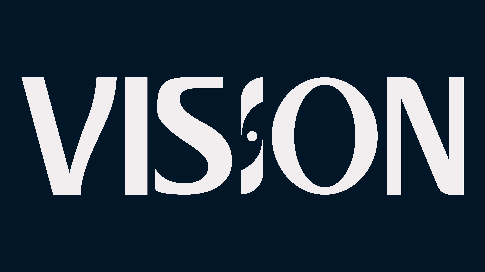

# Vision

<!---Esses são exemplos. Veja https://shields.io para outras pessoas ou para personalizar este conjunto de escudos. Você pode querer incluir dependências, status do projeto e informações de licença aqui--->

> Turn the Vision on its ear. Expand it. Explore it. Embrace Our Vision.

### Made by all and for all

<!---
- [x] Não utilizar caracteres especiais na nomeação de arquivos ex.: , /,~,",&,:,<,>,?,,(,).
- [x] Não começar ou terminar nomes de arquivos com espaços. Ex: Personas
- [x] Utilizar letra maiúscula no começo do arquivos/pastas. Por exemplo: Research.
- [x] Siglas de times devem ser escritas em maiúsculo, pois facilita na busca e organização. Ex.: DPDP, DDS...
- [x] As siglas de times estarão em um glossário para facilitar o entendimento de seus significados.
- [x] Sempre que possível faça o upload de seus arquivos na intranet para que o seu acesso seja possível pelos seus colegas, assim evitando perda de arquivos.
- [x] Evitar criar pastas desnecessariamente.
- [x] Quando possível acrescentar palavras-chave e resumos de conteúdo em boards do Miro entre outros aplicativos.
--->

## 👌Best Practices

  1. Não utilizar caracteres especiais na nomeação de arquivos
  
    Ex: , /,~,",&,:,<,>,?,,(,).

  2. Não começar ou terminar nomes de arquivos com espaços.

  
	Ex: Personas, Miro boards etc

  3. Utilizar letra maiúscula no começo do arquivos/pastas.

  
	Ex: Research

  4. Siglas de times devem ser escritas em maiúsculo, pois facilita na busca e organização.

  
	Ex.: DPDP, DDS...
    As siglas de times estarão em um glossário para facilitar o entendimento de seus significados.
  
  5. Sempre que possível faça o upload de seus arquivos na intranet para que o seu acesso seja possível pelos seus colegas, assim evitando perda de arquivos.

  6. Evitar criar pastas desnecessariamente.

  
  7. Quando possível acrescentar palavras-chave e resumos de conteúdo em boards do Miro entre outros aplicativos.

## 🤝 Our Team

This is the team who brought Vision to life

<table>
  <tr>
    <td align="center">
      <a href="#">
         
        
          <b>Alice Osório</b>
        
      </a>
    </td>
    <td align="center">
      <a href="#">
         
        
          <b>Bernardo Bones</b>
        
      </a>
    </td>
    <td align="center">
      <a href="#">
         
        
          <b>Driele Ferreira</b>
        
      </a>
    </td>
    <td align="center">
      <a href="#">
         
        
          <b>Eduarda Seger</b>
        
      </a>
    </td>
    <td align="center">
      <a href="#">
         
        
          <b>Gabriel Fernandes</b>
        
      </a>
    </td>
    <td align="center">
      <a href="#">
         
        
          <b>Henrique Martiny</b>
        
      </a>
    </td>
    <td align="center">
      <a href="#">
         
        
          <b>Hugo Bonato</b>
        
      </a>
    </td>
    <td align="center">
      <a href="#">
         
        
          <b>Julia Reichert</b>
        
      </a>
    </td>
    <td align="center">
      <a href="#">
         
        
          <b>Leonardo Granado</b>
        
      </a>
    </td>
    <td align="center">
      <a href="#">
         
        
          <b>Pietra Piva</b>
        
      </a>
    </td>
    
  </tr>
</table>

## 😄 Be a contributor

Want to be part of this project?? Click [HERE](CONTRIBUTING.md) and read how to contribute.

## 📝 License

This project is under license. See it here [LICENSE](LICENSE.md) for more details.

