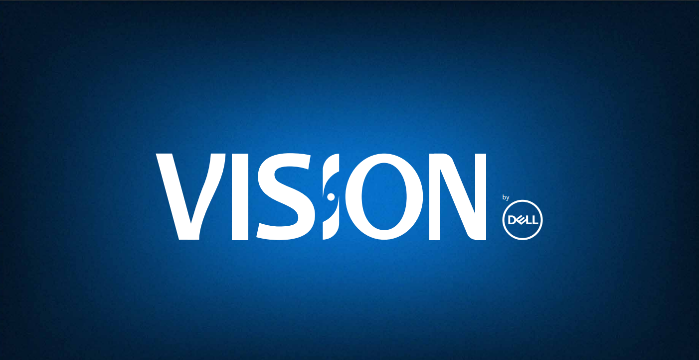

# Vision

<!--- https://shields.ioi --->

> Turn the Vision on its ear. Expand it. Explore it. Embrace Our Vision.

### Made by all and for all

<!---
- [x] Não utilizar caracteres especiais na nomeação de arquivos ex.: , /,~,",&,:,<,>,?,,(,).
- [x] Não começar ou terminar nomes de arquivos com espaços. Ex: Personas
- [x] Utilizar letra maiúscula no começo do arquivos/pastas. Por exemplo: Research.
- [x] Siglas de times devem ser escritas em maiúsculo, pois facilita na busca e organização. Ex.: DPDP, DDS...
- [x] As siglas de times estarão em um glossário para facilitar o entendimento de seus significados.
- [x] Sempre que possível faça o upload de seus arquivos na intranet para que o seu acesso seja possível pelos seus colegas, assim evitando perda de arquivos.
- [x] Evitar criar pastas desnecessariamente.
- [x] Quando possível acrescentar palavras-chave e resumos de conteúdo em boards do Miro entre outros aplicativos.
--->

## 👌 File Organization Practices for Dell Designers Team

  1. Don't use special characters in file naming.
  
    Ex: , /,~,",&,:,<,>,?,,(,).

  2. Use underscore (_) instead of spaces.

	Ex: Research_Personas...

  3. Use capital letter at the beginning of files/folders.

	Ex: Research, Personas, Design...
	
  3. Always name our file.

  4. Team acronyms must maintain their structure, as it facilitates the search and organization. 
  
	Ex.: DPDP, DDS, DFx...
    
  5. Team acronyms  will be in a glossary to facilitate understanding of their meanings
  
  7. Whenever possible, upload your files to the intranet so that your colleagues can access them, thus avoiding loss of files.

  8. Try to avoid creating folders unnecessarily.

  9. When possible, add keywords, summaries and covers to Miro's boards.
  
	Ex.: Team building, Content, Design Feedback, Birthday Card...
	
 10. Whenever possible, keep the filenames short. 	

## 👓 Taxonomy for Dell Designers Team: 

### Team name abbreviation / Project name / File name / Version

	
	Ex: <DPDP> <Vision> <Taxonomy> <1.5>

	
## 🤝 Our Team

This is the team who brought Vision to life

<table>
  <tr>
    <td align="center">
      <a href="#">
         
        
          <b>Alice Osório</b>
        
      </a>
    </td>
    <td align="center">
      <a href="#">
         
        
          <b>Bernardo Bones</b>
        
      </a>
    </td>
    <td align="center">
      <a href="#">
         
        
          <b>Driele Ferreira</b>
        
      </a>
    </td>
    <td align="center">
      <a href="#">
         
        
          <b>Eduarda Seger</b>
        
      </a>
    </td>
    <td align="center">
      <a href="#">
         
        
          <b>Gabriel Fernandes</b>
        
      </a>
    </td>
    <td align="center">
      <a href="#">
         
        
          <b>Henrique Martiny</b>
        
      </a>
    </td>
    <td align="center">
      <a href="#">
         
        
          <b>Hugo Bonato</b>
        
      </a>
    </td>
    <td align="center">
      <a href="#">
         
        
          <b>Julia Reichert</b>
        
      </a>
    </td>
    <td align="center">
      <a href="#">
         
        
          <b>Leonardo Granado</b>
        
      </a>
    </td>
    <td align="center">
      <a href="#">
         
        
          <b>Pietra Piva</b>
        
      </a>
    </td>
    
  </tr>
</table>

## 😄 Be a contributor

Want to be part of this project?? Click [HERE](CONTRIBUTING.md) and read how to contribute.

## 📝 License

This project is under license. See it here [LICENSE](LICENSE.md) for more details.

